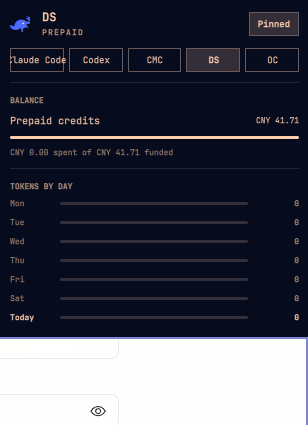

# DeepSeek Usage for Omarchy

Shows DeepSeek usage in the Omarchy agents panel, following the pattern of
[`jhonoryza/omarchy-opencode-usage`](https://github.com/jhonoryza/omarchy-opencode-usage)
and
[`jhonoryza/omarchy-commandcode-usage`](https://github.com/jhonoryza/omarchy-commandcode-usage).



## How it works

- `bin/omarchy-agent-usage-deepseek` asks the official DeepSeek API
  (`GET https://api.deepseek.com/user/balance`) for the account's prepaid
  credit ledger — the fuel-gauge section — using the key opencode stores in
  `~/.local/share/opencode/auth.json` (provider id `deepseek`), falling back
  to `DEEPSEEK_API_KEY`. DeepSeek exposes no token-usage endpoint, so
  local stats come from the same read-only scan of
  `~/.local/share/opencode/opencode.db` the OpenCode collector performs,
  filtered to assistant messages whose `providerID` mentions deepseek.
  The record lands in `~/.local/state/omarchy/agents/usage/deepseek.json`.
- `ui/main.qml` runs the collector every 5 minutes and whenever the usage
  directory changes.
- The agents panel picks up the new tab automatically once the JSON record
  exists. Nothing under `/usr/share/omarchy` is touched.

## Install

```bash
omarchy plugin add https://github.com/jhonoryza/omarchy-deepseek-usage.git --enable
```

## Removal

```bash
omarchy plugin remove dell.deepseek-usage
```

## Manual test

```bash
~/.config/omarchy/plugins/dell.deepseek-usage/bin/omarchy-agent-usage-deepseek | head -n 40
~/.config/omarchy/plugins/dell.deepseek-usage/bin/omarchy-agent-usage-deepseek --write
omarchy plugin validate ~/.config/omarchy/plugins/dell.deepseek-usage
omarchy-shell shell rescanPlugins
```

## Notes

- The panel resolves provider icons from the *agents* plugin's `assets/`
  directory; `deepseek.svg` was added there.
- With no DeepSeek provider active in OpenCode the tab shows the balance
  ledger only; token stats appear automatically once DeepSeek models are
  used through OpenCode.

## Dependencies

- Python 3 (standard library only, no extra packages).
- A DeepSeek API key signed in to opencode, or `DEEPSEEK_API_KEY`.
  Nothing is written outside `~/.local/state/omarchy/agents/usage/`.

## License

MIT
